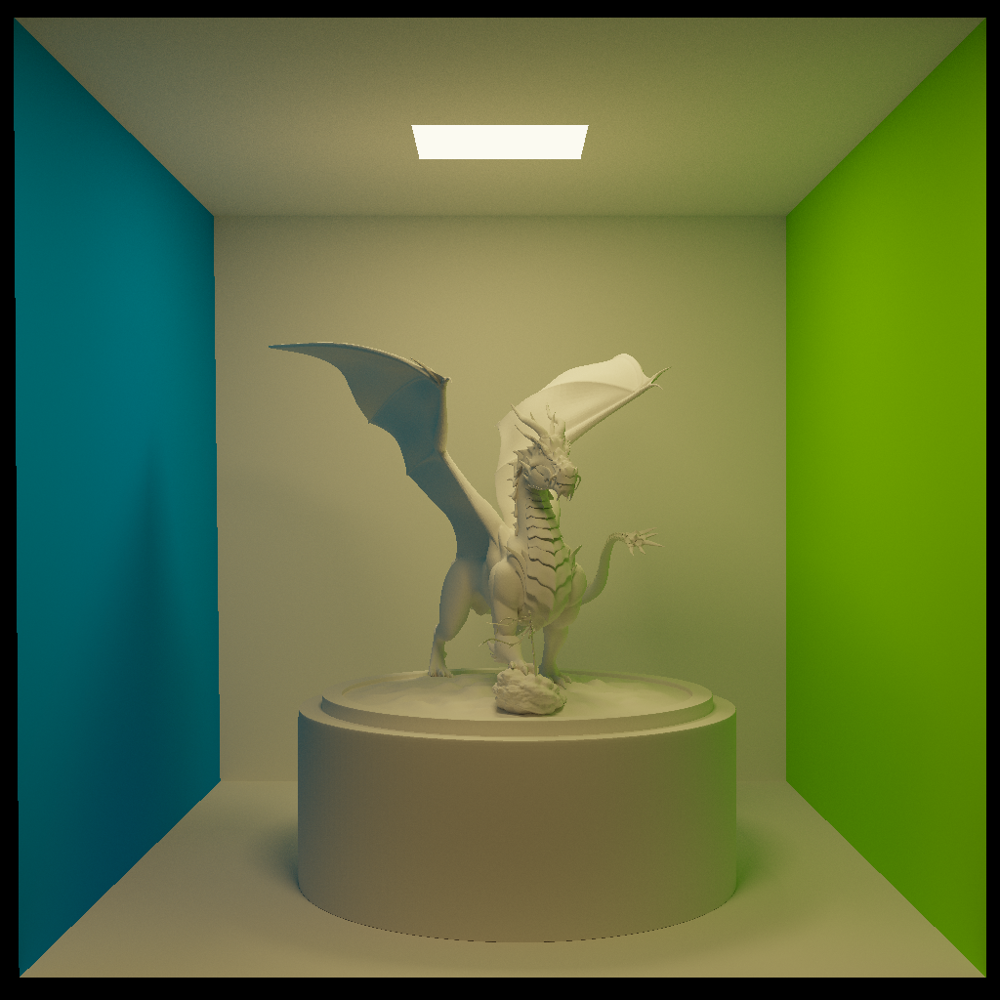
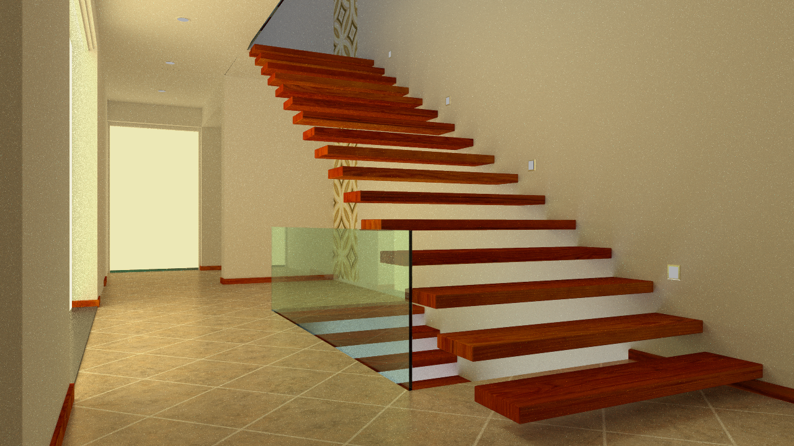
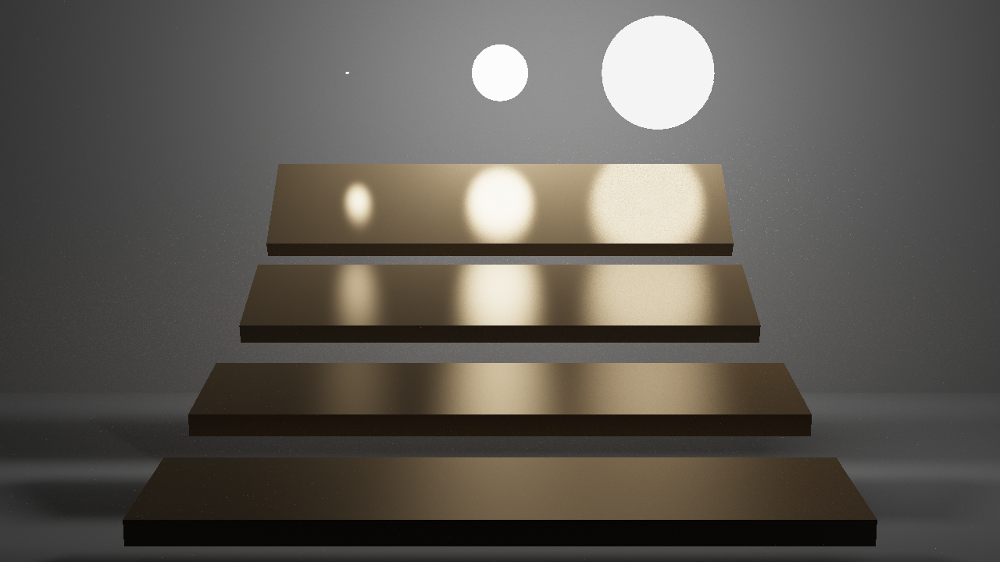

### <center>Document</center>

This is an assignment for the postgraduate course Computer Graphics of Zhejiang University. This project implements a lightweight physically-based renderer on CPU using the Monte Carlo path tracing algorithm. BRDF sampling method is used in this project and the reflectance model is referenced from [paper](https://www.cs.princeton.edu/courses/archive/fall03/cs526/papers/lafortune94.pdf). This project uses LBVH to accelerate ray intersection and OpenMP for multi-threaded parallel acceleration.

#### Testing Environment

* Win10 Visual Studio 2019 c++17

* AMD Ryzen 7 5800X 8-Core Processor
* 32GB RAM
* RTX2060 GPU

#### Compile and Run

##### 1. Visual Studio

open the .sln file to generate the solution and run it in release mode. The command-line arguments and the work directory can be set as follows:


The executable file `PathTracing.exe` can be found in the `exe` folder. To have a quick try:

```
.\PathTracing.exe cornell-box 1024
.\PathTracing.exe veach-mis 2048
.\PathTracing.exe staircase 2048
```

##### 2. Cmake

```
mkdir build
cd build
cmake ..
```

#### Results

Because of the difference in the lighting model used and the parameters of the tone mapping, there is a slight color difference between the results obtained and the reference results. The png and exr results can be found in the `result` folder. `tev.exe` can be employed to open these images.

| Model           | Rendered Image                                           | Description         |
| --------------- | -------------------------------------------------------- | ------------------- |
| **cornell-box** |  | 2048 SPP, 1024x1024 |
| **staircase**   |    | 4096 SPP, 1280x720  |
| **veach-mis**   |    | 4096 SPP, 1280x720  |

#### Class Design

For the sake of brevity, only the important classes are listed here. Some basic classes such as Triangle, AABB, Mesh, Ray etc. are not described.

* `Scene`: define the rendered scene including the model, lighting, camera, BVH and path tracking implementation
* `Render`: define the rendering of the scene (emits ray from the camera and stores the color of each pixel)
* `Material`: define the material parameters and implement the phong reflection model、glass bsdf model and the sampling methods.
* `Model`: define the model required rendering
* `Texture`: define the textures loaded
* `BVH`: define the LBVH tree for ray intersection acceleration
* `Intersection`: define the intersection of ray and triangle

#### Third-party Libraries

1. `Assimp` for reading .obj file and .mtl file

   https://github.com/assimp/assimp

   Since Assimp cannot read the `Tr` parameter in .mtl file, `Tr` is temporarily changed to ` Ka` for convience.

2. `stb` for reading images

   https://github.com/nothings/stb

3. `glm` for basic vector and matrix mathematics

   https://github.com/g-truc/glm

4. `pugixml` for reading .xml file

   https://github.com/zeux/pugixml

5. `svpng` for saving .png file

   https://github.com/miloyip/svpng

6. `tinyexr `for saving .exr file 

   https://github.com/syoyo/tinyexr

These libraries are already included in the project and do not require additional downloads to compile